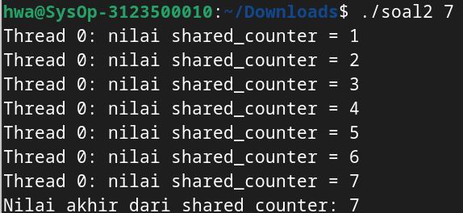
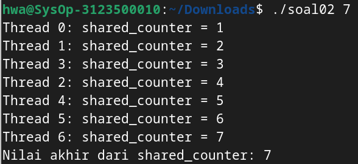

  <h1 class="text-align: center;font-weight: bold">Praktikum 11 Praktek System Operasi</h1>
  <h3 class="text-align: center;">Dosen Pengampu : Dr. Ferry Astika Saputra, S.T., M.Sc.</h3>

 

  
  <h3 style="text-align: center;">Disusun Oleh : </h3>
  

    <strong>Dewangga Wahyu Putera Wangsa (3123500007)</strong> 
    <strong>Hawa Kharisma Zahara (3123500010)</strong> 
    <strong>Bayu Ariyo Vonda Wicaksono(3122500017)</strong>
  

<h3 style="text-align: center;line-height: 1.5">Politeknik Elektronika Negeri Surabaya Departemen Teknik Informatika Dan Komputer Program Studi Teknik Informatika 2023/2024</h3>
  

### Table content

- [Tanpa Mutex](#tanpa-mutex)
- [Menggunakan Mutex](#menggunakan-mutex)

### Analisa Soal 2

#### Soal

    #include <pthread.h>
    #include <stdio.h>
    #include <stdlib.h>

    // Global variable
    int shared_counter = 0;

    void *thread_function(void *thread_id)
    {
    //menginisiasi threat
    pthread_t tid = (pthread_t)thread_id;

    // Increment global var
    shared_counter++;

    printf("Thread %ld: nilai shared_counter = %d\n", (long)tid,
           shared_counter);

    return NULL;
    }

    int main(int argc, char *argv[])
    {

    if (argc != 2)
    {
        printf("Gunakan: %s <number_of_threads>\n", argv[0]);
        exit(EXIT_FAILURE);
    }
    // mengambil nilai masukan jumlha dari thread melalui argumen
    int num_threads = atoi(argv[1]);

    pthread_t *threads = (pthread_t *)malloc(
        num_threads * sizeof(pthread_t));

    // membuat threads
    for (int i = 0; i < num_threads; i++)
    {
        int status = pthread_create(&threads[i], NULL,
                                    thread_function,
                                    (void *)threads[i]);
        if (status != 0)
        {
            printf("Error: pthread_create() returned error "
                   "code %d\n",
                   status);
            exit(EXIT_FAILURE);
        }
    }

    // Wait for all threads to finish execution
    for (int i = 0; i < num_threads; i++)
    {
        int status = pthread_join(threads[i], NULL);
        if (status != 0)
        {
            printf("Error: pthread_join() returned error "
                   "code %d\n",
                   status);
            exit(EXIT_FAILURE);
        }
    }

    // Free the memory allocated for the thread IDs
    free(threads);

    // Print the final value of the shared counter
    printf("Nilai akhir dari shared counter: %d\n",
           shared_counter);

    // Return success
    return 0;
    }

    --------------------------------------------------------------------------------------------------------------------

    #include <pthread.h>
    #include <stdio.h>
    #include <stdlib.h>

    int shared_counter = 0;
    pthread_mutex_t shared_counter_mutex =  PTHREAD_MUTEX_INITIALIZER;

    void *thread_function(void *thread_id)
    {
    
    long tid = (long)thread_id;

  
    pthread_mutex_lock(&shared_counter_mutex);

    
    shared_counter++;

    printf("Thread %ld: shared_counter = %d\n", tid,
           shared_counter);

    pthread_mutex_unlock(&shared_counter_mutex);

   
    return NULL;
    }

    int main(int argc, char *argv[])
    {
   
    if (argc != 2)
    {
        printf("Penggunaan %s <number_of_threads>\n", argv[0]);
        exit(EXIT_FAILURE);
    }

   
    int num_threads = atoi(argv[1]);

    pthread_t *threads = (pthread_t *)malloc(
        num_threads * sizeof(pthread_t));

    for (int i = 0; i < num_threads; i++)
    {
        int status = pthread_create(
            &threads[i], NULL, thread_function, (void *)i);
        if (status != 0)
        {
            printf("Error: pthread_create() returned error "
                   "code %d\n",
                   status);
            exit(EXIT_FAILURE);
        }
    }

   
    for (int i = 0; i < num_threads; i++)
    {
        int status = pthread_join(threads[i], NULL);
        if (status != 0)
        {
            printf("Error: pthread_join() returned error "
                   "code %d\n",
                   status);
            exit(EXIT_FAILURE);
        }
    }

    // Free the memory untuk thread IDs
    free(threads);

    
    printf("Nilai akhir dari shared_counter: %d\n",
           shared_counter);

    // Return success
    return 0;

    }

#### Tanpa Mutex:

Program pertama adalah Pthreads (POSIX Threads) untuk membuat beberapa thread. Tujuannya adalah untuk memperlihatkan penggunaan thread dalam sebuah program dan bagaimana variabel global dapat diakses dan dimodifikasi oleh beberapa thread secara bersamaan. Program dimulai dengan mendeklarasikan variabel global `shared_counter` yang akan menjadi titik fokus utama untuk diakses dan dimodifikasi oleh thread-thread yang dibuat. Setiap thread akan menjalankan fungsi `thread_function` yang bertanggung jawab untuk menambahkan nilai `shared_counter` dengan satu, mencetak nilai tersebut bersama dengan identitas thread yang sedang berjalan, dan mengembalikan nilai null.

Tidak ada sinkronisasi yang digunakan untuk mengakses variabel global shared_counter. Ini berpotensi menimbulkan kondisi balapan (race condition) di mana beberapa thread dapat mengakses dan memodifikasi shared_counter secara bersamaan, menghasilkan nilai akhir yang tidak akurat dan tidak sesuai dengan jumlah thread yang dibuat.

#### Menggunakan Mutex

Program ini menggunakan mutex shared_counter_mutex untuk mensinkronisasi akses ke variabel global shared_counter. Setiap thread yang ingin memodifikasi shared_counter harus terlebih dahulu memperoleh kunci (lock) pada mutex, memastikan hanya satu thread yang dapat mengakses dan memodifikasi shared_counter pada satu waktu. Ini mencegah kondisi balapan dan menjamin nilai akhir yang akurat.

#### Kesimpulan 

Dalam program multithreaded yang mengakses data bersama, sangat penting untuk menggunakan mekanisme sinkronisasi seperti mutex untuk memastikan akses terkontrol dan menghindari kondisi balapan. 
