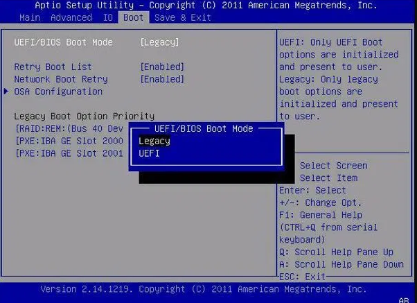

  <h1 class="text-align: center;font-weight: bold">Praktikum 2 Praktek System Operasi</h1>
  <h3 class="text-align: center;">Dosen Pengampu : Dr. Ferry Astika Saputra, S.T., M.Sc.</h3>

 

  
  <h3 style="text-align: center;">Disusun Oleh : </h3>
  

    <strong>Dewangga Wahyu Putera Wangsa (3123500007)</strong> 
    <strong>Hawa Kharisma Zahara (3123500010)</strong> 
    <strong>Bayu Ariyo Vonda Wicaksono (3122500017)</strong>
  

<h3 style="text-align: center;line-height: 1.5">Politeknik Elektronika Negeri Surabaya Departemen Teknik Informatika Dan Komputer Program Studi Teknik Informatika 2023/2024</h3>
  

## Daftar Isi

1. [Pendahuluan](#pendahuluan)
2. [Perbedaan Legacy dan UEFI](#perbedaan-legacy-dan-uefi)
3. [Referensi](#referensi)

## Pengertian BIOS

BIOS merupakan singkatan dari Basic Input Output System. merupakan suatu software (ditulis dalam bahasa assembly) yang mengatur fungsi dasar dari perangkat keras (hardware) komputer. BIOS tertanam dalam sebuah chip memory (ROM ataupun Flash Memory) berbahan Comlpimentari Metal Oxide Semiconductor (CMOS) yang terdapat pada motherboard. Sebuah baterai yang biasa disebut sebagai baterai CMOS berfungsi untuk menjaga agar tanggal dan settingan lainnya yang telah kita set pada BIOS tidak hilang atau kembali ke konfigurasi awal meskipun komputer dimatikan.

## Perbedaan Legacy dan UEFI

Proses booting pada UEFI (Unified Extensible Firmware Interface) berbeda dengan Legacy BIOS (Basic Input/Output System). Berikut adalah langkah-langkah umum dalam proses booting UEFI:

1. **Power On Self Test (POST)**: Proses booting dimulai dengan POST, di mana firmware UEFI melakukan pemeriksaan awal terhadap perangkat keras untuk memastikan semuanya berfungsi dengan baik.

2. **UEFI Firmware Initialization**: Setelah POST selesai, firmware UEFI diinisialisasi. Ini meliputi identifikasi dan inisialisasi perangkat keras seperti CPU, RAM, dan perangkat penyimpanan.

3. **UEFI Boot Manager**: Setelah firmware diinisialisasi, UEFI Boot Manager dimuat. Boot Manager adalah program yang memilih perangkat booting yang sesuai. Ini dapat memuat beberapa file konfigurasi, seperti NVRAM (Non-Volatile Random Access Memory) atau file konfigurasi di partisi EFI System.

4. **Boot Option Menu**: Jika ada lebih dari satu perangkat booting yang tersedia, Boot Manager menampilkan menu opsi booting, di mana pengguna dapat memilih perangkat booting yang diinginkan.

5. **Loading Boot Loader**: Setelah perangkat booting dipilih, Boot Manager memuat boot loader yang sesuai. Boot loader memuat sistem operasi ke dalam memori dan memulai eksekusi.

6. **Loading Kernel**: Boot loader memuat kernel sistem operasi ke dalam memori dan memulai eksekusi. Kernel mengelola sumber daya perangkat keras dan menjalankan aplikasi.

7. **Init Process**: Setelah kernel dimuat, proses init (biasanya systemd pada distribusi Linux modern) dimulai. Ini adalah proses pertama yang dijalankan setelah kernel dan bertanggung jawab untuk memulai proses lain serta mengelola sistem.

8. **User Space**: Setelah proses init selesai, sistem operasi memasuki user space, di mana pengguna dapat mulai menjalankan aplikasi.

Proses booting pada UEFI memiliki beberapa keuntungan, termasuk kemampuan untuk boot dari partisi GPT yang lebih besar, dukungan untuk booting jaringan (PXE boot), dan fitur keamanan seperti Secure Boot.

Berikut adalah langkah-langkah umum dalam proses booting Legacy BIOS:

1. **Power On Self Test (POST)**: Proses booting dimulai dengan POST, di mana firmware BIOS melakukan pemeriksaan awal terhadap perangkat keras untuk memastikan semuanya berfungsi dengan baik.

2. **BIOS Initialization**: Setelah POST selesai, BIOS diinisialisasi. Ini meliputi identifikasi dan inisialisasi perangkat keras seperti CPU, RAM, dan perangkat penyimpanan.

3. **Master Boot Record (MBR) Loading**: Setelah BIOS diinisialisasi, BIOS mencari MBR di perangkat booting yang ditentukan. MBR adalah bagian pertama dari disk yang berisi kode boot loader.

4. **Boot Loader Loading**: Setelah MBR ditemukan, BIOS memuat boot loader yang sesuai. Boot loader memuat sistem operasi ke dalam memori dan memulai eksekusi.

5. **Loading Kernel**: Boot loader memuat kernel sistem operasi ke dalam memori dan memulai eksekusi. Kernel mengelola sumber daya perangkat keras dan menjalankan aplikasi.

6. **Init Process**: Setelah kernel dimuat, proses init (biasanya systemd pada distribusi Linux modern) dimulai. Ini adalah proses pertama yang dijalankan setelah kernel dan bertanggung jawab untuk memulai proses lain serta mengelola sistem.

7. **User Space**: Setelah proses init selesai, sistem operasi memasuki user space, di mana pengguna dapat mulai menjalankan aplikasi.

Proses booting pada Legacy BIOS memiliki beberapa kelemahan, termasuk keterbatasan dalam ukuran partisi booting (hingga 2TB) dan jumlah partisi primer (hingga 4), serta tidak adanya fitur keamanan seperti Secure Boot.

## Referensi

- [Apa itu BIOS?](https://inspirasiituindaharie.wordpress.com/2021/04/02/perbedaan-antara-bios-uefi-dan-bios-legacy/)
- [Perbedaan Legacy dan UEFI](https://kumparan.com/how-to-tekno/perbedaan-uefi-dan-legacy-simak-penjelasannya-di-sini-20b8sBrgRs4/4)
