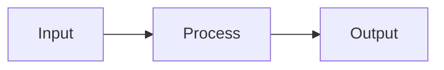
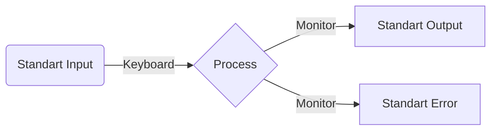
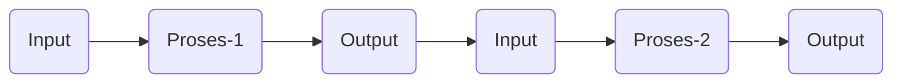
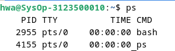
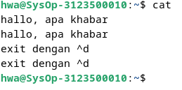
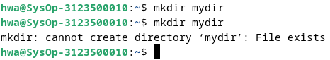
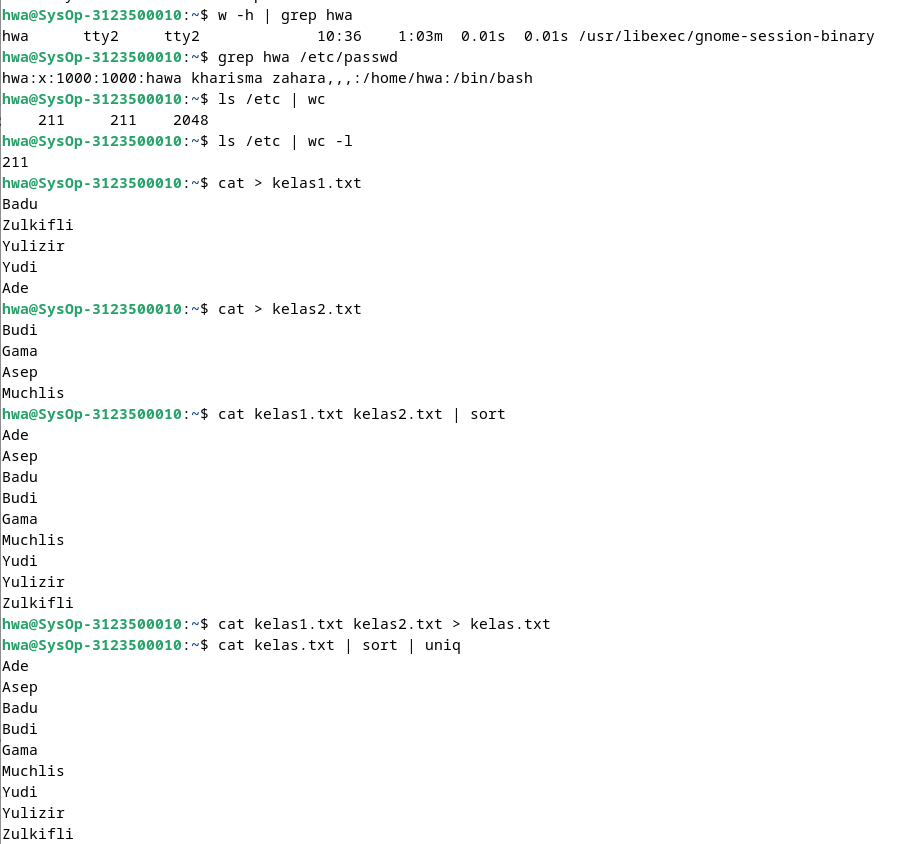

# Operasi Input Output

Referensi : [Shell Programming](https://www.geeksforgeeks.org/introduction-linux-shell-shell-scripting/?ref=shm_)

## POKOK BAHASAN:

```
* Pipeline
* Redirection
```

## TUJUAN PEMBELAJARAN:

Setelah mempelajari materi dalam bab ini, mahasiswa diharapkan mampu:

- Memahami konsep proses I/O dan redirection
- Memahami standar input, output dan error
- Menggunakan notasi output, append dan here document
- Memahami konsep _PIPE_ dan filter

## DASAR TEORI:

### 1. PROSES I/O

Sebuah proses memerlukan Input dan Output. Instruksi (command) yang diberikan pada Linux melalui Shell disebut sebagai eksekusi program yang selanjutnya disebut proses. Setiap kali instruksi diberikan, maka Linux kernel akan menciptakan sebuah proses dengan memberikan nomor PID (Process Identity). Proses dalam Linux selalu membutuhkan Input dan menghasilkan suatu Output.



Dalam konteks Linux input/output adalah :

- Keyboard (input)
- Layar (output)
- Files
- Struktur data kernel
- Peralatan I/O lainnya (misalnya Network)

## 2. FILE DESCRIPTOR

Linux berkomunikasi dengan file melalui file descriptor yang direpresentasikan melalui angka yang dimulai dari 0, 1, 2 dan seterusnya. Tiga buah file descriptor standar yang lalu diciptakan oleh proses adalah :

- 0 = keyboard (standar input)
- 1 = layar (standar output)
- 2 = layar (standar error)

Linux tidak membedakan antara peralatan hardware dan file. Linux memanipulasi peralatan hardware dengan memperlakukannya sama dengan ketika memperlakukan sebuah file.

## 3.PEMBELOKAN (REDIRECTION)

Pembelokan dilakukan untuk standard input, output dan error, yaitu untuk mengalihkan file descriptor dari 0, 1 dan 2. Simbol untuk pembelokan adalah :



## 4. PIPA (PIPELINE)

Mekanisme pipa digunakan sebagai alat komunikasi antar proses.



Proses-1 menghasilkan output yang selanjutnya digunakan sebagai input oleh Proses-2. Hubungan output input ini dinamakan `pipa ataiupipelining`, yang menghubungkan Proses-1 dengan Proses-2 dan dinyatakan dengan symbol “|”.

```
    Proses1 | Proses
```

## 5. FILTER

Filter adalah utilitas Linux yang dapat memproses standard input (dari keyboard) dan menampilkan hasilnya pada standard output (layar). Contoh filter adalah cat, sort, grep, pr, head, tail, paste dan lainnya.
Pada sebuah rangkaian pipa :

        P<sub>1</sub> | P<sub>2</sub> | P<sub>3</sub> ... | P<sub>n-1</sub> | P<sub>n</sub>

Maka P2 sampai dengan P<sub>n-1</sub> berfungsi sebagai filter. P1 (awal) dan Pn (terakhir) boleh tidak filter. Utilitas yang bukan filter misalnya who, ls, ps, lp, lpr, mail dan lainnya.
Beberapa perintah Linux yang digunakan untuk proses penyaringan antara lain :

- Perintah `grep`
  Digunakan untuk menyaring masukannya dan menampilkan baris-baris yang hanya mengandung pola yang ditentukan. Pola ini disebut regular expression.
- Perintah `wc`
  Digunakan untuk menghitung jumlah baris, kata dan karakter dari baris-baris masukan yang diberikan kepadanya. Untuk mengetahui berapa baris gunakan option –l, untuk mengetahui berapa kata, gunakan option –w dan untuk mengetahui berapa karakter, gunakan option –c.
  Jika salah satu option tidak digunakan, maka tampilannya adalah jumlah baris, jumlah kata dan jumlah karakter.
- Perintah `sort`
  Digunakan untuk mengurutkan masukannya berdasarkan urutan nomor ASCII dari karakter.
- Perintah `cut`
  Digunakan untuk mengambil kolom tertentu dari baris-baris masukannya, yang ditentukan pada option –c.
- Perintah `uniq`
  Digunakan untuk menghilangkan baris-baris berurutan yang mengalami duplikasi, biasanya digabungkan dalam pipeline dengan `sort`.

## TUGAS PENDAHULUAN:

## Jawablah pertanyaan-pertanyaan di bawah ini :

1. Apa yang dimaksud redirection?

   - Pembelokan dilakukan untuk standard input, output dan error, yaitu untuk mengalihkan file descriptor dari 0, 1 dan 2.

2. Apa yang dimaksud pipeline?

   - Suatu mekanisme pipa yang digunakan sebagai alat komunikasi antar proses.

3. Apa yang dimaksud perintah di bawah ini :
   echo, cat, more, sort, grep, wc, cut, uniq

   - echo : digunakan untuk menampilkan text.
     cat : perintah untuk melihat isi file.
     more : digunakan untuk membuka file satu per satu.
     sort : digunakan untuk mengurutkan .masukannya berdasarkan urutan nomor ASCII dari karakter.
     grep : digunakan untuk menyaring masukannya dan menampilkan baris-baris yang hanya mengandung pola yang ditentukan.
     wc : digunakan untuk menghitung jumlah baris, kata dan karakter dari baris-baris masukan yang diberikan kepadanya.
     cut : digunakan untuk mengambil kolom tertentu dari baris-baris masukannya,
     uniq : digunakan untuk menghilangkan baris-baris berurutan yang mengalami duplikasi, biasanya digabungkan dalam pipeline dengan sort.

## PERCOBAAN:

1. Login sebagai user.
2. Bukalah Console Terminal dan lakukan percobaan-percobaan di bawah ini. Perhatikan hasil setiap percobaan.
3. Selesaikan soal-soal latihan.

## Percobaan 1 : File descriptor

1. Output ke layar (standar output), input dari system (kernel)

   ```
   $ ps
   ```

   Hasil Output

   

   Analisa :
      Perintah $ps  digunakan untuk menampilkan informasi tentang proses yang sedang berjalan di sistem.

2. Output ke layar (standar output), input dari keyboard (standard input)

   ```
    $ cat
    hallo, apa khabar
    hallo, apa khabar
    exit dengan ^d
    exit dengan ^d
    [Ctrl-d]
   ```

   Hasil Output

   

   Analisa :
   Program `cat` diatas mengambil teks yang diketik user sebagai masukan, lalu mencetaknya kembali di layar. Dalam contoh, teks "hallo, apa khabar" maka yang diketik akan dicetak dua kali. Ketika selesai mengetik dan ingin keluar dari program, maka dengan menekan tombol `Ctrl-d`. Itu menandakan bahwa tidak ada lagi teks yang ingin dimasukkan, dan program `cat` pun berhenti.

3. Input nama direktori, output tidak ada (membuat direktori baru), bila terjadi error maka tampilan error pada layar (standard error)

   ```
   $ mkdir mydir
   $ mkdir mydir **(Terdapat pesan error)**
   ```

   Hasil Output

   

   Analisa :
   Perintah pertama, `$ mkdir mydir`, berhasil membuat direktori baru dengan nama `mydir`. Namun, pada perintah kedua, `$ mkdir mydir`, terjadi kesalahan karena argumen yang diberikan tidak valid. Ketika user mencoba membuat direktori bernama `mydir` di dalam `mydir` yang sama, sistem menghasilkan pesan kesalahan karena `mydir` sudah ada dan tidak dapat dibuat lagi dengan nama yang sama.

## Percobaan 2 : Pembelokan (redirection)

1. Pembelokan standar output

   ```
    $ cat 1> myfile.txt
    Ini adalah teks yang saya simpan ke file myfile.txt
   ```

   Hasil Output

   

   Analisa :
   Perintah `$ cat 1> myfile.txt` bertujuan untuk menyalurkan output dari perintah `cat` ke dalam file yang disebut `myfile.txt`.

2. Pembelokan standar input, yaitu input dibelokkan dari keyboard menjadi dari file

   ```
    $ cat 0< myfile.txt
    $ cat myfile.txt
   ```

   Hasil Output

   

   Analisa :
   Perintah `$ cat 0< myfile.txt` berfungsi untuk mengambil input dari file `myfile.txt` dan menampilkan isinya di terminal menggunakan perintah `cat`. Sintaksis `0<` menunjukkan bahwa input standar (`0`) dialihkan dari file `myfile.txt`. Setelah itu, perintah `$ cat myfile.txt` juga digunakan untuk menampilkan isi file yang sama, namun dengan menggunakan argumen langsung nama file. 


3. Pembelokan standar error untuk disimpan di file

   ```
    $ mkdir mydir (Terdapat pesan error)
    $ mkdir mydir 2> myerror.txt
    $ cat myerror.txt
   ```

   Hasil Output

   
   
   Analisa :
   Perintah `$ mkdir mydir`, mencoba membuat direktori baru dengan nama `mydir`. Namun, pesan kesalahan terjadi karena `mydir`  sudah ada dalam direktori saat ini. Kemudian, perintah `$ mkdir mydir 2> myerror.txt` dimaksudkan untuk menyalurkan pesan kesalahan (stderr) dari perintah sebelumnya ke dalam file yang disebut `myerror.txt`. Terakhir, perintah `$ cat myerror.txt` digunakan untuk menampilkan isi file `myerror.txt`, yang berisi pesan kesalahan yang dihasilkan oleh perintah sebelumnya saat mencoba membuat direktori `mydir`.

   
4. Notasi 2>&1 : pembelokan standar error (2>) adalah identik dengan file descriptor 1.

   ```
    $ ls filebaru (Terdapat pesan error)
    $ ls filebaru 2> out.txt
    $ cat out.txt
    $ ls filebaru 2> out.txt 2>&
    $ cat out.txt
   ```

   Hasil Output

   

   Analisa :
   Perintah `$ ls filebaru` dimaksudkan untuk menampilkan isi direktori dengan nama `filebaru`. Namun, pesan error muncul karena direktori tersebut tidak ada. Selanjutnya, perintah `$ ls filebaru 2> out.txt` digunakan untuk menyalurkan pesan kesalahan dari perintah sebelumnya ke dalam file `out.txt`, sehingga tidak akan ditampilkan di layar. Namun, perintah `$ cat out.txt` yang mengikuti menunjukkan bahwa file tersebut masih kosong, menunjukkan bahwa tidak ada pesan kesalahan yang disalurkan ke dalamnya. 
   
5. Notasi 1>&2 (atau >&2) : pembelokan standar output adalah sama dengan file descriptor 2 yaitu standar error

   ```
   $ echo “mencoba menulis file” 1> baru
   $ cat filebaru 2> baru 1>&
   $ cat baru
   ```

   Hasil Output

   

   Analisa :
   Perintah `$ echo “mencoba menulis file” 1> baru` bertujuan untuk menuliskan teks "mencoba menulis file" ke dalam file bernama `baru`. Namun, terdapat kesalahan dalam sintaks tanda kutip yang digunakan, sehingga nama file `baru` tidak akan diperbarui dengan teks yang dimaksud. Selanjutnya, perintah `$ cat filebaru 2> baru 1>&` memiliki kesalahan sintaksis, karena tidak ada arahan yang ditujukan untuk aliran data. Oleh karena itu, perintah tersebut tidak akan berjalan dengan benar. Terakhir, perintah `$ cat baru` digunakan untuk menampilkan isi file `baru`.

6. Notasi >> (append)

   ```
   $ echo “kata pertama” > surat
   $ echo “kata kedua” >> surat
   $ echo “kata ketiga” >> surat
   $ cat surat
   $ echo “kata keempat” > surat
   $ cat surat
   ```

   Hasil Output

   

   Analisa :
   Perintah pertama, `$ echo “kata pertama” > surat`, membuat file bernama `surat` dan menuliskan teks "kata pertama" ke dalamnya. Perintah kedua, `$ echo “kata kedua” >> surat`, menambahkan teks "kata kedua" ke dalam file `surat` tanpa menghapus isi yang sudah ada. Sama halnya, perintah ketiga, `$ echo “kata ketiga” >> surat`, menambahkan teks "kata ketiga" ke dalam file `surat` tanpa menghapus isi yang sudah ada. Ketika perintah `$ cat surat` dieksekusi, isi file `surat`, yaitu "kata pertama", "kata kedua", dan "kata ketiga", akan ditampilkan di layar. Namun, perintah selanjutnya, `$ echo “kata keempat” > surat`, akan menggantikan isi file `surat` dengan teks "kata keempat", sehingga isi sebelumnya, yaitu "kata pertama", "kata kedua", dan "kata ketiga", akan terhapus. Ketika perintah `$ cat surat` dieksekusi kembali, hanya "kata keempat" yang akan ditampilkan, karena isi sebelumnya telah digantikan.

7. Notasi here document (<<++ .... ++) digunakan sebagai pembatas input dari keyboard. Perhatikan bahwa tanda pembatas dapat digantikan dengan tanda apa saja, namun harus sama dan tanda penutup harus diberikan pada awal baris

   ```
   $ cat <<++
   Hallo, apa kabar?
   Baik-baik saja?
   Ok!
   ++
   $ cat <<%%%
   Hallo, apa kabar?
   Baik-baik saja?
   Ok!
   %%%
   ```

   Hasil Output

   

   Analisa :
   Perintah `$ cat <<++` dan `$ cat <<%%%` digunakan untuk mengeksekusi perintah `cat` dengan input teks yang panjang. Sementara `++` dan `%%%` bertindak sebagai penanda akhir yang menunjukkan akhir blok. Isi dari heredoc adalah teks yang berada di antara penanda awal dan penanda akhir. Jadi, ketika perintah `$ cat <<++` dijalankan, teks "Hallo, apa kabar?\nBaik-baik saja?\nOk!\n" akan diberikan sebagai input ke perintah `cat`, yang kemudian akan mencetak teks tersebut ke layar. 

8. Notasi – (input keyboard) adalah representan input dari keyboard. Artinya menampilkan file 1, kemudian menampilkan input dari keyboard dan menampilkan file 2. Perhatikan bahwa notasi “-“ berarti menyelipkan input dari keyboard

```
$ cat myfile.txt – surat
```

Hasil Output


Analisa
Perintah `$ cat myfile.txt – surat` untuk menampilkan isi dari dua file, yaitu `myfile.txt` dan `surat`, secara bersamaan dengan menggunakan perintah `cat`. 

## Percobaan 3 : Pipa (pipeline)

1. Operator pipa (|) digunakan untuk membuat eksekusi proses dengan melewati data langsung ke data lainnya.

   ```
   $ who
   $ who | sort
   $ who | sort –r
   $ who > tmp
   $ sort tmp
   $ rm tmp
   $ ls –l /etc | more
   $ ls –l /etc | sort | more
   ```

   Hasil Output

   

   

   Analisa :
   Perintah pertama `$ who` digunakan untuk menampilkan daftar pengguna yang saat ini masuk ke dalam sistem. Perintah kedua, `$ who | sort`, memanfaatkan operator pipeline (`|`) untuk mengirim output dari perintah `who` ke perintah `sort`, yang akan mengurutkan daftar pengguna berdasarkan urutan alfabetis. Perintah ketiga, `$ who | sort -r`, mencoba untuk mengurutkan daftar pengguna dalam urutan terbalik. Perintah berikutnya, `$ who > tmp`, menyalin output dari perintah `who` ke dalam file sementara yang bernama `tmp`. Selanjutnya, perintah `$ sort tmp` mengurutkan isi file `tmp` dan menampilkannya di terminal. Setelah itu, perintah `$ rm tmp` digunakan untuk menghapus file sementara `tmp`. Perintah terakhir, `$ ls -l /etc | more`, menampilkan isi direktori `/etc` dalam format yang lebih detail, kemudian mengirim outputnya ke perintah `more`, yang memungkinkan pengguna untuk melihat isi yang lebih banyak dengan cara berpindah halaman. 

2. Untuk membelokkan standart output ke file, digunakan operator ">"

   ```
   $ echo hello
   $ echo hello > output
   $ cat output
   ```

   Hasil Output

   

   Analisa :
   Perintah `$ echo hello >> output` digunakan untuk menambahkan teks "hello". Setelah itu, perintah `$ cat output` digunakan untuk menampilkan isi dari file `output` di layar.

3. Untuk menambahkan output ke file digunakan operator ">>"

   ```
   $ echo bye >> output
   $ cat output
   ```

   Hasil Output

   

   Analisa :
   Perintah `$ echo bye >> output` digunakan untuk menambahkan teks "bye". Operator `>>` digunakan untuk menambahkan output dari perintah `echo` ke akhir file `output`, tanpa menghapus isi yang sudah ada di dalamnya. Setelah itu, perintah `$ cat output` digunakan untuk menampilkan isi dari file `output` di layar.

4. Untuk membelokkan standart input digunakan operator "<"

   ```
   $ cat < output
   ```

   Hasil Output

   

   Analisa :
   Perintah $ cat output digunakan untuk menampilkan isi dari file yang sudah ada.


5. Pembelokan standart input dan standart output dapat dikombinasikan tetapi tidak boleh menggunakan nama file yang sama sebagai standart input dan output.

   ```
   $ cat < output > out
   $ cat out
   $ cat < output >> out
   $ cat out
   $ cat < output > output
   $ cat output
   $ cat < out >> out (Proses tidak berhenti)
   [Ctrl-c]
   $ cat out
   ```

   Hasil Output

   

   Analisa :
   Perintah `$ cat < output > out`, untuk menyalurkan isi dari file `output` ke perintah `cat` melalui input standar, dan kemudian mengarahkan output dari `cat` ke file `out`. Setelah itu, perintah `$ cat out` digunakan untuk menampilkan isi dari file `out`. Perintah selanjutnya, `$ cat < output >> out`, untuk menambahkan isi dari file `output` ke file `out` tanpa menghapus isi yang sudah ada. Oleh karena itu, isi dari `output` akan ditambahkan ke akhir file `out`. Perintah `$ cat out` kemudian menampilkan isi file `out`, yang sekarang berisi dua salinan dari isi file `output`.Perintah `$ cat < out >> out` mencoba untuk menambahkan isi file `out` ke file `out` itu sendiri, yang akan menyebabkan proses tersebut berjalan tanpa henti, karena output dari `cat` akan terus ditambahkan ke file `out`, menciptakan loop tak terbatas. Untuk menghentikan proses, pengguna harus menekan `Ctrl-c`. Terakhir, perintah `$ cat out` menampilkan isi dari file `out`, yang kemungkinan besar berisi banyak salinan dari isi file `output` sebelum proses dihentikan.

## Percobaan 4 : Filter

1. Pipa juga digunakan untuk mengkombinasikan utilitas sistem untuk membentuk fungsi yang lebih kompleks

   ```
    $ w –h | grep <user>
    $ grep <user> /etc/passwd
    $ ls /etc | wc
    $ ls /etc | wc –l
    $ cat > kelas1.txt
    Badu
    Zulkifli
    Yulizir
    Yudi
    Ade
    [Ctrl-d]
    $ cat > kelas2.txt
    Budi
    Gama
    Asep
    Muchlis
    [Ctrl-d]
    $ cat kelas1.txt kelas2.txt | sort
    $ cat kelas1.txt kelas2.txt > kelas.txt
    $ cat kelas.txt | sort | uniq
   ```

   Hasil Output

   

   Analisa :
   Pertama, perintah `$ w -h | grep <user>` untuk menampilkan informasi tentang pengguna yang sedang masuk ke sistem (dengan menghilangkan header), kemudian menggunakan `grep` untuk mencari baris yang mengandung kata `<user>`. Namun, penggunaan `<user>` di sini adalah penggunaan generik, bukan nama pengguna yang spesifik.

   Perintah berikutnya, `$ grep <user> /etc/passwd`, bertujuan untuk mencari entri pengguna dengan nama pengguna `<user>` dalam file `/etc/passwd`, yang berisi daftar pengguna yang terdaftar di sistem.

   Perintah `$ ls /etc | wc` digunakan untuk menghitung jumlah baris, kata, dan byte dari hasil perintah `ls /etc`, yaitu daftar isi direktori `/etc`.

   Perintah `$ ls /etc | wc -l` bertujuan untuk menghitung jumlah file dan direktori dalam direktori `/etc`, dengan menggunakan opsi `-l` untuk hanya menghitung jumlah baris (yaitu jumlah file dan direktori).

   Perintah berikutnya menciptakan dua file teks (`kelas1.txt` dan `kelas2.txt`) dengan menggunakan perintah `cat > namafile`. Setiap file berisi daftar nama siswa.

   Setelah itu, perintah `$ cat kelas1.txt kelas2.txt | sort` digunakan untuk menggabungkan isi dari kedua file dan mengurutkannya.

   Perintah `$ cat kelas1.txt kelas2.txt > kelas.txt` bertujuan untuk menggabungkan isi dari kedua file menjadi satu file bernama `kelas.txt`.

   Perintah `$ cat kelas.txt | sort | uniq` bertujuan untuk menggabungkan isi dari file `kelas.txt`, mengurutkannya, dan menghilangkan baris yang duplikat menggunakan perintah `uniq`.

## LATIHAN:

1. Lihat daftar secara lengkap pada direktori aktif, belokkan tampilan standard output ke file baru.
   

   Analisa :
   Pada latihan ini, langkah awalnya adalah menggunakan perintah `ls` untuk menampilkan daftar file dalam direktori aktif. Selanjutnya, output dari perintah `ls` dialihkan ke sebuah file baru menggunakan operator penyaluran output, kemudian isi dari file tersebut dicetak.

2. Lihat daftar secara lengkap pada direktori /etc/passwd, belokkan tampilan standard output ke file baru tanpa menghapus file baru sebelumnya.
 

   Analisa :
   Menggunakan perintah `ls` untuk menampilkan isi dari direktori `/etc/passwd`, hasilnya dialihkan ke dalam sebuah file baru tanpa menggantikan isi dari file tersebut sebelumnya, menggunakan operator `>>`.

3. Urutkan file baru dengan cara membelokkan standard input.
 

   Analisa :
   Standard input dari sebuah file baru diarahkan ke perintah sort untuk mengurutkan isi berdasarkan huruf pertama. Dalam hal ini, file tersebut menjadi input untuk sort.

4. Urutkan file baru dengan cara membelokkan standard input dan standard output ke file baru.urut.
 

   Analisa :
   Menggunakan perintah sort untuk mengurutkan isi dari file baru berdasarkan huruf pertama, dengan file tersebut sebagai input. Hasil dari perintah sort kemudian dialihkan ke sebuah file baru bernama "baru_urut", dan kemudian file tersebut dicetak menggunakan perintah cat.

5. Buatlah direktori latihan 2 sebanyak 2 kali dan belokkan standard error ke file rmdirerror.txt.
 

   Analisa :
   Membuat direktori `latihan2` menggunakan perintah `mkdir` dua kali berturut-turut, yang menghasilkan pesan kesalahan. Pesan kesalahan tersebut dialihkan ke dalam file `rmdierror.txt` menggunakan operator untuk pembelokan standar error, yaitu `2>`. Kemudian, isi dari file `rmdierror.txt` dicetak menggunakan perintah `cat`.

6. Urutkan kalimat berikut :

   ```
   Jakarta
   Bandung
   Surabaya
   Padang
   Palembang
   Lampung
   ```

   Dengan menggunakan notasi **here document (<@@@ ...@@@)** . [HINT](https://www.geeksforgeeks.org/how-to-use-here-document-in-bash-programming/)
 

   Analisa :
   Membuat daftar nama kota menggunakan notasi here document `<@....@` dan menyimpannya ke dalam file bernama `kota.txt`. Selanjutnya, saya mengurutkan isi dari file tersebut menggunakan perintah `sort`.

7. Hitung jumlah baris, kata dan karakter dari file baru.urut dengan menggunakan filter dan tambahkan data tersebut ke file baru.
 

   Analisa :
   Standard input dari perintah `cat` diarahkan ke file "baru.urut", sehingga isi file tersebut dijadikan input untuk perintah `cat`. Selanjutnya, dengan menggunakan pipeline, output dari perintah tersebut dialihkan ke perintah `wc` untuk menghitung jumlah baris, kata, dan karakter dari file "baru.urut". Hasil dari perintah tersebut kemudian disimpan ke dalam file baru tanpa menghapus isi sebelumnya, menggunakan operator `>>`.

8. Gunakan perintah di bawah ini dan perhatikan hasilnya.
   ```
    $ cat > hello.txt
    dog cat
    cat duck
    dog chicken
    chicken duck
    chicken cat
    dog duck
    [Ctrl-d]
    $ cat hello.txt | sort | uniq
    $ cat hello.txt | grep “dog” | grep –v “cat”
   ```
   

   Analisa :
   Perintah `$ cat > hello.txt` digunakan untuk membuat file baru dengan nama "hello.txt" dan memungkinkan pengguna untuk memasukkan beberapa baris teks, termasuk kata-kata seperti "dog", "cat", "duck", dan "chicken". Kemudian, perintah `$ cat hello.txt | sort | uniq` membaca isi dari "hello.txt", mengurutkannya secara alfabetis menggunakan perintah `sort`, dan kemudian menghilangkan baris-baris yang sama menggunakan perintah `uniq`, sehingga hanya menampilkan setiap kata sekali saja. Sementara itu, perintah `$ cat hello.txt | grep "dog" | grep -v "cat"` membaca isi dari "hello.txt", menyaring baris yang mengandung kata "dog" menggunakan `grep`, dan kemudian menghilangkan baris yang juga mengandung kata "cat" dengan menggunakan opsi `-v` di `grep`, sehingga hanya menampilkan baris yang mengandung kata "dog" namun tidak mengandung kata "cat".
   <br>
   ## KESIMPULAN

   Redirection, Pipeline, dan Commands yang disebutkan di atas adalah komponen penting sistem operasi UNIX/Linux dan digunakan untuk mengatur aliran data, mengatur file, dan melakukan operasi teks.

   - Redirection: Dalam UNIX/Linux, proses mengalihkan aliran data standar masukan (stdin), standar keluaran (stdout), dan standar kesalahan (stderr) dikenal sebagai redirection.
   - Pipeline memungkinkan pengguna mengalirkan keluaran dari satu perintah ke masukan perintah lain secara langsung tanpa menyimpannya ke dalam file sementara. Contoh penggunaan redirection adalah >, <, >>, dan 2>. Ini memungkinkan pengguna melakukan tugas yang kompleks dengan menggabungkan beberapa perintah bersama-sama. Simbol "|" menandai pipa. Misalnya, komando 1 dan komando 2 akan mengalirkan keluaran dari.
   - Perintah-perintah:
   `echo` Menampilkan teks atau variabel ke output standar.
   `cat` Membaca isi file dan menampilkannya di output standar.
   `more` Menampilkan isi file satu layar pada satu waktu.
   `sort` Mengurutkan baris-baris inputnya berdasarkan urutan ASCII.
   `grep` Mengambil inputnya dan mencari pola yang cocok, lalu menampilkan baris yang sesuai.
   `wc` Menghitung jumlah baris, kata, dan karakter dari inputnya.
   `cut` Memotong kolom-kolom tertentu dari inputnya.
   `uniq` Menghilangkan baris duplikat berturut-turut dari inputnya.

    

## LAPORAN RESMI:

1. Analisa hasil percobaan 1 sampai dengan 4, untuk setiap perintah jelaskan tampilannya.
2. Kerjakan latihan diatas dan analisa hasilnya
3. Berikan kesimpulan dari praktikum ini.
