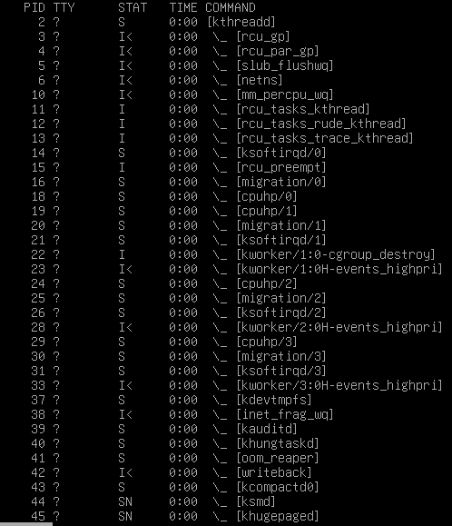
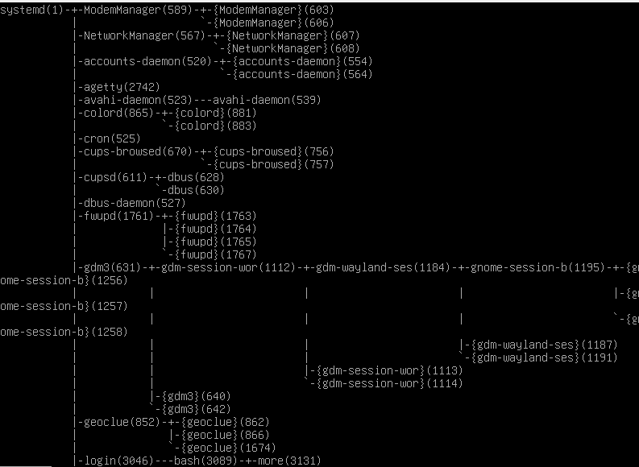
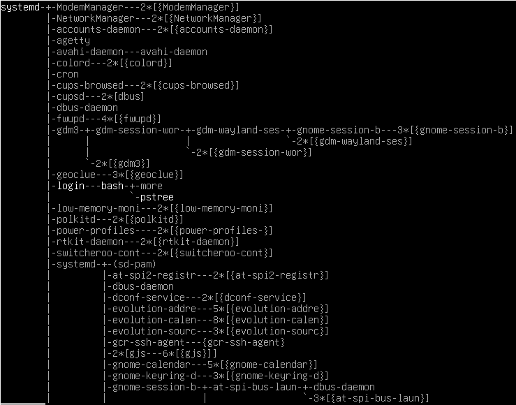
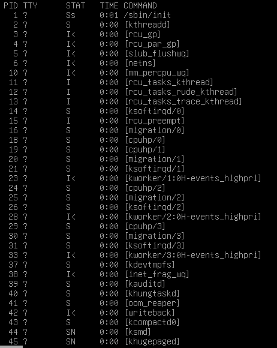
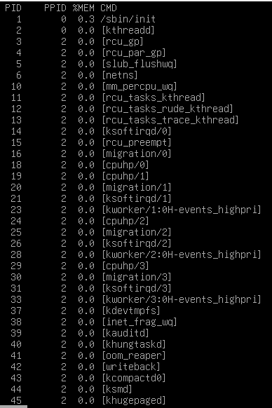

# PRAKTIKUM 5

## Proses dan Manajemen Proses

### POKOK BAHASAN

- Proses pada Sistem Operasi Linux
- Manajemen Proses pada Sistem Operasi Linux

### TUJUAN BELAJAR

Setelah mempelajari materi dalam bab ini, mahasiswa diharapkan mampu:

- Memahami konsep proses pada sis tem operasi Linux.
- Menampilkan beberapa cara menampilkan hubungan proses parent dan child.
- Menampilkan status proses dengan beberapa format berbeda.
- Melakukan pengontrolan proses pada shell.
- Memahami penjadwalan prioritas.

### DASAR TEORI

#### 1. KONSEP PROSES PADA SISTEM OPERASI LINUX

Proses adalah program yang sedang dieksekusi. Setiap kali menggunakan utilitas sistem atau program aplikasi dari shell, satu atau lebih proses ”child” akan dibuat oleh shell sesuai perintah yang diberikan. Setiap kali instruksi dibe rikan pada Linux shell, maka kernel akan menciptakan sebuah proses-id. Proses ini disebut juga dengan terminology Unix sebagai sebuah Job. Proses Id (PID) dimulai dari 0, yaitu proses INIT, kemudian diikuti oleh proses berikutnya (terdaftar pada /etc/inittab).
Beberapa tipe proses :

- Foreground  
  Proses yang diciptakan oleh pemakai langsung pada terminal (interaktif, dialog)
- Batch  
  Proses yang dikumpulkan dan dijalankan secara sekuensial (satu persatu). Prose Batch tidak diasosiasikan (berinteraksi) dengan terminal.
- Daemon  
  Proses yang menunggu permintaan (request) dari proses lainnya dan menjalankan tugas sesuai dengan permintaan tersebut. Bila tidak ada request, maka program ini akan berada dalam kondisi “idle” dan tidak menggunakan waktu hitung CPU. Umumnya nama proses daemon di UNIX berakhiran d, misalnya inetd, named, popd dll

#### 2. SINYAL

Proses dapat mengirim dan menerima sinyal dari dan ke proses lainnya. Proses mengirim sinyal melalui instruksi “kill” dengan format  

    kill [-nomor sinyal] PID

Nomor sinyal : 1 s/d maksimum nomor sinyal yang didefinisikan system Standar nomor sinyal yang terpenting adalah :

| No Sinyal | Nama    | Deskripsi                                                                             |
| --------- | ------- | ------------------------------------------------------------------------------------- |
| 1         | SIGHUP  | Hangup, sinyal dikirim bila proses terputus, misalnya melalui putusnya hubungan modem |
| 2         | SIGINT  | Sinyal interrupt, melalui ^C                                                          |
| 3         | SIGQUIT | Sinyal Quit, melalui ^\|                                                              |
| 9         | SIGKILL | Sinyal Kill, menghentikan proses                                                      |
| 15        | SIGTERM | Sinyal terminasi software                                                             |

#### 3. MENGIRIM SINYAL

Mengirim sinyal adalah satu alat komunikasi antar proses, yaitu memberitahukan proses yang sedang berjalan bahwa ada sesuatu yang harus dikendalikan. Berdasarkan sinyal yang dikirim ini maka proses dapat bereaksi dan administrator/programmer dapat menentukan reaksi tersebut. Mengirim sinyal menggunakan instruksi

    kill [-nomor sinyal] PID

Sebelum mengirim sinyal PID proses yang akan dikirim harus diketahui terlebih dahulu.

#### 4. MENGONTROL PROSES PADA SHELL

Shell menyediakan fasilitas job control yang memungkinkan mengontrol beberapa job atau proses yang sedang berjalan pada waktu yang sama. Misalnya bila melakukan pengeditan file teks dan ingin melakukan interrupt pengeditan untuk mengerjakan hal lainnya. Bila selesai, dapat kembali (switch) ke editor dan melakukan pengeditan file teks kembali. 
Job bekerja pada <strong>foreground</strong> atau <strong>background</strong>. Pada foreground hanya diper untukkan untuk satu job pada satu waktu. Job pada foreground akan mengontrol shell - menerima input dari keyboard dan mengirim output ke layar. Job pada background tidak menerima input dari terminal, biasanya berjalan tanpa memerlukan interaksi 
Job pada foreground kemungkinan dihentikan sementara (suspend), dengan menekan [Ctrl-Z]. Job yang dihentikan sementara dapat dijalankan kembali pada foreground atau background sesuai keperluan dengan menekan <strong>”fg”</strong> atau <strong>”bg”</strong>. Sebagai catatan, menghentikan job seme ntara sangat berbeda dengan melakuakan interrupt job (biasanya menggunakan [Ctrl-C]), dimana job yang diinterrup akan dimatikan secara permanen dan tidak dapat dijalankan lagi.

#### 5. MENGONTROL PROSES LAIN

Perintah ps dapat digunakan untuk menunjukkan semua proses yang sedang berjalan pada mesin (bukan hanya proses pada shell saat ini) dengan format :

    ps –fae atau
    ps -aux

Beberapa versi UNIX mempunyai utilitas sistem yang disebut top yang menyediakan cara interaktif untuk memonitor aktifitas sistem. Statistik secara detail dengan proses yang berjalan ditampilkan dan secara terus-menerus di-refresh . Proses ditampilkan secara terurut dari utilitas CPU. Kunci yang berguna pada top adalah

    s – set update frequency
    u – display proses dari satu user
    k – kill proses (dengan PID)
    q – quit

Utilitas untuk melakukan pengontrolan proses dapat ditemukan pada sistem UNIX adalah perintah killall. Perintah ini akan menghentikan proses sesuai PID atau job number proses.

#### TUGAS PENDAHULUAN :

Jawablah pertanyaan-pertanyaan di bawah ini :

1.  Apa yang dimaksud dengan proses ?

        Proses adalah program yang sedang dieksekusi.

2.  Apa yang dimaksud perintah untuk menampilkan status proses : ps,pstree

        - Ps adalah Perintah yang dapat digunakan untuk menunjukkan semua proses yang sedang berjalan pada mesin (bukan hanya proses pada shell saat ini). Instruksi ps (processstatus) digunakan untuk melihat kondisi proses yang ada.

        - Pstree Sama halnya dengan perintah ps. Pstree juga mempunyai fungsi yang sama untuk melihat status proses yang berjalan pada sistem. Tetapi informasinya di perlihat dengan bentuk tree (pohon)

3.  Sebutkan opsi yang dapat diberikan pada perintah ps

        a. $ps untuk melihat kondisi proses yang ada

        b. $ps -u untuk melihat faktor/element lainnya

        c. $ps -u <user> mencari proses yang spesifik pemakai

        d. $ps -a mencari proses lainnya (all)

        e. $ps -au mencari proses lainnya (all user)

        f. $ps -eH untuk semua proses, H untuk hirarki tampilan proses

        g. $ps -e f menampilkan status proses dengan karakter grafis

4.  Apa yang dimaksud dengan sinyal?Apa perintah untuk mengirim sinyal?

        Sinyal adalah pesan yang dikirim oleh sistem operasi atau proses lain ke proses atau thread untuk memberikan notifikasi atau meminta tindakan tertentu. Proses dapat mengirim dan menerima sinyal dari dan ke proses lainnya.

        Proses mengirim sinyal melalui instruksi “kill” dengan format kill [-nomor sinyal] PID

5.  Apa yang dimaksud dengan proses foreground dan background pada job control

        Pada foreground hanya diperuntukkan untuk satu job pada satu waktu. Job pada foreground akan mengontrol shell - menerima input dari keyboard dan mengirim output ke layar. Job pada background tidak menerima input dari terminal, biasanya berjalan tanpa memerlukan interaksi.

6.  Apa yang dimaksud perintah - perintah penjadwalan prioritas :

        a. Top : Memonitor aktifitas system.

        b. Nice : mengubah prioritas pada proses.

        c. Renice : mengurangi prioritas pada proses.

#### PERCOBAAN:

1.  Login sebagai user.

    

2.  Download program C++ untuk menampilkan bilangan prima yang bernama
    primes.

    

        Analisa:

        Program di atas menampilkan bilangan prima sampai ke N. Ketika dijalankan, program meminta input N dari pengguna dan menampilkan bilangan prima.

3.  Lakukan percobaan-percobaan di bawah ini kemudian analisa hasil percobaan.
4.  Selesaikan soal-soal latihan.

#### Percobaan 1 : Status Proses

6.  Pindah ke command line terminal (tty2) dengan menekan Ctrl+Alt+F2
    dan login ke terminal sebagai user.

    

        Analisa:

        Ketika pertama masuk ke terminal akan langsung diarahkan untuk login dan password. Setelah itu baru bisa mengakses command line sebagai user. Jika password salah, command line tidak bisa diakses dan akan terus diarahkan untuk login

7.  Instruksi ps (process status) digunakan untuk melihat kondisi proses yang ada. PID adalah Nomor Identitas Proses, TTY adalah nama terminal dimana proses tersebut aktif, STAT berisi S (Sleepin g) dan R (Running), COMMAND merupakan instruksi yang digunakan.

    `$ ps`

    

        Analisa:

        Perintah ps digunakan untuk melihat proses yang ada.Perintah yang sudah dijalankan baru ada dua yaitu bash dan ps itu sendiri. Setiap perintah ini memiliki nomor identitas atau PID. Bash singkatan dari bourne again shell, digunakan untuk menerjemahkan user dengan kernel.

8.  Untuk melihat fak tor/elemen lainnya, gunakan option –u (user). %CPU adalah presentasi CPU time yang digunakan oleh proses tersebut, %MEM adalah presentasi system memori yang digunakan proses, SIZE adalah jumlah memori yang digunakan, RSS (Real System Storage) adalah jumlah memori yang digunakan, START adalah kapan proses tersebut diaktifkan

    `$ ps -u`

    

        Analisa :

        ps -u untuk melihat semua proses yang dijalankan oleh user pada semua terminal.

9.  Mencari proses yang spesifik pemakai. Proses diatas hanya terbatas pada proses milik pemakai, dimana pemakai teresbut melakukan login

    `$ ps –u < user >`

    

10. Mencari proses lainnya gunakan opsi a (all) dan au (all user)

    `$ ps –a`
    `$ ps –au`

    

11. Logout dan tekan Alt+F7 untuk kembali ke mode grafis

    

#### Percobaan 2 : Menampilkan Hubungan Proses Parent dan Child

1.  Pindah ke command line terminal (tty2) dengan menekan Ctrl+Alt+F2 dan login ke terminal sebagai user.

    

        Analisa:

        Ketika pertama masuk ke terminal akan langsung diarahkan untuk login dan password. Setelah itu baru bisa mengakses command line sebagai user. Jika password salah, command line tidak bisa diakses dan akan terus diarahkan untuk login

2.  Ketik ps –eH dan tekan Enter. Opsi e memilih semua proses dan opsi H menghasilkan tampilan proses secara hierarki. Proses child muncul dibawah proses parent. Proses child ditandai dengan awalan beberapa spasi.

    `$ ps -eH`

    

        Analisa:

        Semua proses dalam daftar ditampilkan dengan perintah $ ps -eH, yang mempertimbangkan hierarki perintahnya. Di depan nama child CMD, ada spasi. Tulisan di sebelah kanan kolom CMD menjorok ke kanan, seperti yang ditunjukkan pada gambar.

3.  Ketik ps –e f dan tekan Enter. Tampilan serupa dengan langkah 2. Opsi
    –f akan menampilkan status proses dengan karakter grafis (\ dan \_)

    `$ ps –e f`

    

        Analisa:

        Perintah ini sama dengan yang sebelumnya, tetapi proses child ditandai dengan karakter grafis(\_) daripada spasi. Sebagai contoh, perintah /bin/login -p memiliki proses child -bash, dan perintah -bash memiliki proses anak ps -e f.

4.  Ketik pstree dan tekan Enter. Akan ditampilkan semua proses pada sistem dalam bentuk hirarki parent/child. Proses parent di sebelah kiri proses child. Sebagai contoh proses init sebagai parent (ancestor) dari semua proses pada sistem. Beberapa child dari init mempunyai child. Proses login mempunya i proses bash sebagai child. Proses bash mempunyai proses child startx. Proses startx mempunyai child xinit dan seterusnya.

    `$ pstree`

    

        Analisa:

        Dengan perintah ini, semua perintah akan ditampilkan dalam bentuk tree atau pohon, bersama dengan garis yang menghubungkannya. Perintah ini membuat proses parent dan child terlihat jelas. Proses child lebih menjorok ke kanan dari proses parentnya, dan ada garis yang menghubungkannya satu sama lain.

5.  Ketik pstree | grep mingetty dan tekan Enter. Akan menampilkan semua proses mingetty yang berjalan pada system yang berupa console virtual. Selain menampikan semua proses, proses dikelompokkan dalam satu baris dengan suatu angka sebagai jumlah proses yang berjalan.

    `$ pstree | grep mingetty`

    

        Analisa:

        Dengan menggunakan perintah ini, saya dapat menampilkan semua proses mingetty yang berjalan pada sistem saya dalam console virtual. Karena tidak ada program mingetty pada sistem operasi saya, outputnya kosong.

6.  Untuk melihat semua PID untuk proses gunakan opsi –p.

    `$ pstree –p`

    

        Analisa:

        Proses tampilan perintah ini serupa dengan tampilan perintah yang digunakan pada proses praktikum bagian 5, di mana data ditampilkan dalam bentuk struktur diagram atau pohon. Namun, pada perintah ini, informasi PID proses yang digunakan hanya ditambahkan dengan Opsi "-p".

7.  Untuk menampilk an proses dan ancestor yang tercetak tebal gunakan opsi
    –h.

    `$ pstree –h`

    

        Analisa:

        perintah "pstree" menambahkan opsi "-h" yang memungkinkan menampilkan proses dan ancestor secara dicetak atau ditampilkan tebal.

#### Percobaan 3 : Menampilkan Status Proses dengan Berbagai Format

9.  Pindah ke command line terminal (tty2) dengan menekan Ctrl+Alt+F2 dan login ke terminal sebagai user.

    

        Analisa:

        Ketika pertama masuk ke terminal akan langsung diarahkan untuk login dan password. Setelah itu baru bisa mengakses command line sebagai user. Jika password salah, command line tidak bisa diakses dan akan terus diarahkan untuk login

10. Ketik ps –e | more dan tekan Enter. Opsi -e menampilkan semua proses dalam bentuk 4 kolom : PID, TTY, TIME dan CMD.

    `$ ps –e | more`

    

    Jika halaman penuh terlihat prompt --More-- di bagian bawah screen, tekan q untuk kembali ke prompt perintah.

        Analisa:

        Percobaan ini adalah untuk melihat semua intruksi/command yang ada secara berurutan dari perintah nomor 1 dalam satu halaman penuh (perintah $ more). Pada gambar di atas, pada bagian tty terdapat tanda tanya yang berarti perintah tersebut tidak sedang dijalankan pada terminal manapun.

11. Ketik ps ax | more dan tekan Enter. Opsi a akan menampilkan semua proses yang dihasilkan terminal (TTY). Opsi x menampilkan semua proses yang tidak dihasilkan terminal. Secara logika opsi ini sama dengan opsi –e . Terdapa 5 kolom : PID, TTY, STAT, TIME dan COMMAND.

    `$ ps ax | more`

    

    Jika halaman penuh terlihat prompt --More-- di bagian bawah screen, tekan q untuk kembali ke prompt perintah.

        Analisa:

        3. Hasil perintah ini sama dengan perintah di nomor 2, yang berbeda hanyalah kolom yang ditampilkan ada 5 yaitu PID, tty, Stat, time dan CMD. TIME adalah waktu yang diperlukan oleh CPU untuk memproses perintah atau command aplikasi tersebut. STAT adalah kode status proses. Kode Status Process di Linux

        D uninterruptible sleep (biasanya IO)
        R proses sedang berjalan/dapat dijalankan (saat masuk queue/antrian)
        S sleep dan sedang menunggu event selesai
        T Diberhentikan oleh job kontrol
        Z Zombi process karena tidak diberhentikan oleh induk process
        < proses dengan prioritas tinggi
        N proses dengan prioritas rendah
        L process telah dikunci dalam memory untuk process realtime dan custom IO
        s Session leader
        l Multi threaded menggunakan CLONE_THREAD, seperti yang dilakukan oleh NPTL pthreads

        - group untuk proses yang ada tampilan nya dan bisa dilihat user,bukan background process.

12. Ketik ps –e f | more dan tekan Enter. Opsi –e f akan menampilkan semua proses dalam format daftar penuh.

    `$ ps ef | more`

    

    Jika halaman penuh terlihat prompt --More-- di bagian bawah screen, tekan q untuk kembali ke prompt perintah.

        Analisa:

        Hasil perintah ini adalah menampilkan semua proses dalam format daftar penuh. Sebagai contoh, pada gambar di atas terdapat perintah –bash pada terminal 3, -ps ef dan more.

13. Ketik ps –eo pid, cmd | more dan tekan Enter. Opsi –eo akan menampilkan semua proses dalam format sesuai definisi user yaitu terdiri dari kolom PID dan CMD.

    `$ ps –eo pid,cmd | more`

    

    Jika halaman penuh et rlihat prompt --More-- di bagian bawah screen, tekan q untuk kembali ke prompt perintah.

        Analisa:

        Opsi –eo akan menampilkan semua proses dalam format sesuai definisi user yaitu terdiri dari kolom PID dan CMD. Karena perintahnya hanya PID dan CMD, maka yang ditampilkan hanya PID dan CMDnya. Kemudian perintah ini menggunakan perintah more, yang artinya hasil akan dalam satu halaman penuh, dan perlu menekan enter untuk menampilkan perintah selanjutnya.

14. Ketik ps –eo pid,ppid,%mem,cmd | more dan tekan Enter. Akan menampilkan kolom PID, PPID dan %MEM. PPID adalah proses ID dari proses parent. %MEM menampilkan persentasi memory system yang digunakan proses. Jika proses hanya menggunakan sedikit memory system akan dita mpilkan 0.

    `$ ps –eo pid,ppid,%mem,cmd | more`

    

        Analisa:

        Format yang ditampilkan hasil sesuai perintah yang diminta yaitu PID, PPID, %MEM dan CMD.

15. Logout dan tekan Alt+F7 untuk kembali ke mode grafis

    

        Analisa:

        Dengan melakukan perintah logout maka terminal akan logout dan kembali seperti pertama kali terminal dibuka, yaitu meminta login.

#### Percobaan 4 : Mengontrol proses pada shell

1.  Pindah ke command line terminal (tty2) dengan menekan Ctrl+Alt+F2 dan login ke terminal sebagai user.

    

        Analisa:

        Ketika pertama masuk ke terminal akan langsung diarahkan untuk login dan memasukkan password. Setelah itu baru bisa mengakses command line sebagai user.

2.  Gunakan perintah yes yang mengirim output y yang tidak pernah berhenti

    `$ yes`

    Untuk menghentikannya gunakan Ctrl-C.

    

        Analisa:

        perintah yes ini digunakan untuk menampilkan output 'y' yang tidak pernah berhenti.

        Untuk menghentikannya gunakan Ctrl-C.

3.  Belokkan standart output ke /dev/null

    `$ yes > /dev/null`

    

        Analisa:

        Perintah diatas digunakan membelokan standart output dari yes ke /dev/null

        Untuk menghentikannya gunakan Ctrl-C.

4.  Salah satu cara agar perintah yes tetap dijalankan tetapi shell tetap digunakan untuk hal yang lain dengan meletakkan proses pada background dengan
    menambahkan karakter & pada akhir perintah.

    `$ yes > /dev/null &`

    

        Analisa:

        Dengan meletakkan proses pada background dengan menambah karakter & dan job number pid pada akhir perintah[1], perintah yes tetap dijalankan.

        Angka dalam ”[ ]” merupakan job number diikuti PID.

5.  Untuk melihat status proses gunakan perintah jobs.

    `$ jobs`

    

        Analisa:

        Perintah ini digunakan untuk melihat proses yang telah digunakan

6.  Untuk menghentikan job, gunakan perintah kill diikuti job number atau PID proses. Untuk identifikasi job number, diikuti prefix dengan karakter ”%”.

    `$ kill %<nomor job> contoh : kill %1`

    

        Analisa:

        Perintah di atas digunakan untuk menghentikan pekerjaan untuk yes dan pekerjaan untuk melihat proses yang telah diterminasi.

7.  Lihat status job setelah diterminasi

    `$ jobs`

    

        Analisa:

        Perintah ini digunakan untuk melihat proses yang telah digunakan